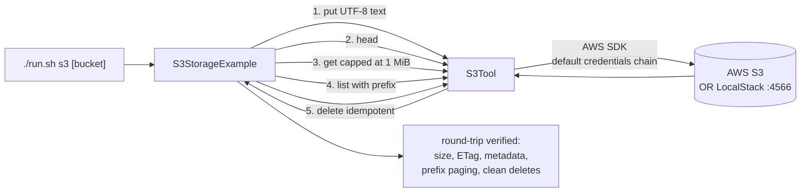

# S3 Cloud Storage Example

> **New to SwarmAI?** Start from the [quickstart template](../quickstart-template/) for the
> minimum viable app. This example is *direct-tool-drive* — autowire `S3Tool` and call
> `.execute(Map.of(...))` for `put` / `get` / `list` / `delete` / `head`.


Exercises **`S3Tool`** end-to-end against a real bucket: `put` → `head` → `get` → `list` → `delete`.
Works against real AWS S3 or a local LocalStack container.

## How it works



## Prerequisites

### Option A — real AWS (recommended for validation)

| Env var              | Purpose                                                                    |
|----------------------|----------------------------------------------------------------------------|
| `AWS_REGION`         | e.g. `eu-central-1`                                                        |
| `AWS_ACCESS_KEY_ID`  | IAM user with `s3:PutObject`, `s3:GetObject`, `s3:ListBucket`, `s3:DeleteObject` on the test bucket |
| `AWS_SECRET_ACCESS_KEY` | pairs with the access key                                               |
| `S3_TEST_BUCKET`     | A bucket you own (or an arg to `./run.sh s3 <bucket>`)                     |

Credentials are resolved through the AWS default chain — env vars, `~/.aws/credentials`,
IAM roles, ECS task roles, instance metadata, etc.

### Option B — LocalStack (fully local, no AWS account)

LocalStack mocks S3 with `docker`:

```bash
docker run --rm -it -p 4566:4566 -p 4510-4559:4510-4559 \
  -e SERVICES=s3 \
  -e DEFAULT_REGION=us-east-1 \
  --name localstack localstack/localstack:latest
```

Then, in another shell, create a bucket and set env vars pointing the AWS SDK at LocalStack:

```bash
aws --endpoint-url=http://localhost:4566 s3 mb s3://swarmai-test-bucket

export AWS_ACCESS_KEY_ID=test
export AWS_SECRET_ACCESS_KEY=test
export AWS_REGION=us-east-1
export AWS_ENDPOINT_URL_S3=http://localhost:4566
export S3_TEST_BUCKET=swarmai-test-bucket
```

The tool picks up `AWS_ENDPOINT_URL_S3` automatically and enables path-style access — no code
changes needed.

## Run

```bash
./run.sh s3                           # uses S3_TEST_BUCKET
./run.sh s3 my-bucket-name
```

## What to expect

A full round-trip against a real bucket (or LocalStack): `put` a UTF-8 text object → `head` to
read size / ETag / metadata → `get` with the 1 MiB safety cap → `list` with a prefix →
`delete`. Each step prints its result; `delete` is verified to be idempotent.

## Value add

Enterprise agents live and die by object storage. This tool gives them first-class read/write
access to S3 (or LocalStack for CI), with idempotent delete, OOM-safe gets, and clean error
messages the LLM can reason about — no bespoke AWS SDK wrapper per workflow.

## What this proves about the tool

- Put writes UTF-8 text with the user-supplied `Content-Type`, returns a byte count.
- Head returns size / ETag / Last-Modified / user metadata in a readable block.
- Get enforces the 1 MiB safety cap (oversized objects return a hint, no OOM).
- List with a prefix returns paged results and surfaces truncation hints when `is_truncated=true`.
- Delete is idempotent — deleting twice doesn't error.
- `NoSuchBucket` / `NoSuchKey` are translated into specific user-facing messages (not SDK stack traces).
- LocalStack endpoint override works without code modification — the tool reads
  `AWS_ENDPOINT_URL_S3` and auto-switches to path-style access.
