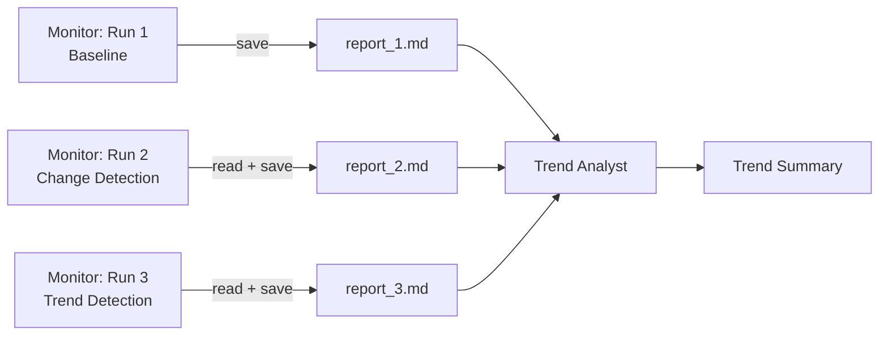

# Scheduled / Monitoring Agent Workflow

Simulates a recurring monitoring agent that runs on a schedule, persists findings to files between runs, compares current state against previous reports, and produces a trend analysis across all iterations.

## Architecture



## What You'll Learn

- Running workflows repeatedly with file-based state persistence between executions
- Fresh Swarm instances per iteration (simulating cron-triggered runs)
- Comparing agent outputs across runs to detect changes
- Trend detection pattern: baseline, change detection, evolution analysis
- FileReadTool and FileWriteTool for inter-run communication

## Prerequisites

- Ollama running locally (or OpenAI/Anthropic API key configured)
- No additional API keys required

## Run

```bash
./run.sh scheduled                                           # default topic
./run.sh scheduled "kubernetes cluster performance metrics"   # custom topic
./run.sh scheduled "API response time monitoring"             # custom topic
```

## How It Works

The workflow executes three monitoring iterations followed by a final trend analysis. Iteration 1 produces a baseline report analyzing the current state of the topic. Iteration 2 reads the baseline via FileReadTool, compares the current state against it, and identifies changes. Iteration 3 reads iteration 2's report and detects emerging trends. Each iteration is a fresh Swarm execution -- the only shared state is the report files on disk, mirroring how a real scheduled agent would operate. After all iterations, a Trend Analyst agent reads all three reports and produces an evolution summary covering stable findings, emerging trends, and trajectory-based recommendations.

## Output

- `output/scheduled_report_1.md` -- Baseline monitoring report
- `output/scheduled_report_2.md` -- Change detection report (compared to report 1)
- `output/scheduled_report_3.md` -- Trend detection report (compared to report 2)
- `output/scheduled_trend_summary.md` -- Evolution summary across all runs

## YAML DSL

This workflow can also be defined declaratively in YAML. See [`workflows/scheduled-monitoring.yaml`](src/main/resources/workflows/scheduled-monitoring.yaml):

```java
// Load and run via YAML instead of Java
Swarm swarm = swarmLoader.load("workflows/scheduled-monitoring.yaml",
    Map.of("topic", "AI market trends"));
SwarmOutput output = swarm.kickoff(Map.of());
```

The YAML definition includes file-based tools for historical comparison and trend detection.
