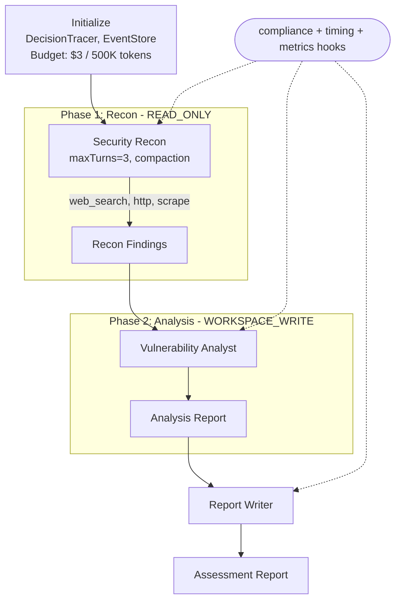

# Secure Ops Workflow

Security assessment pipeline with tiered permissions, compliance hooks, skill curation, and full observability.

## Architecture



## Features Combined

This example demonstrates 10 framework features working together:

| Feature | How It's Used |
|---|---|
| Tiered Permissions | Recon agent is `READ_ONLY`; Analysis and Report agents are `WORKSPACE_WRITE` |
| Tool Hooks (Compliance) | Blocks tool calls targeting `.gov` / `.mil` domains before execution |
| Tool Hooks (Timing/SLA) | Warns when any tool call exceeds the 10-second SLA threshold |
| Tool Hooks (Metrics) | Counts all tool calls and tracks cumulative execution time |
| Skill Curation | `SkillCurator.assess()` grades any runtime-generated skills with a pass/fail bar |
| Decision Tracing | `DecisionTracer` records why each agent made each choice; saved to file |
| Event Replay | `EventStore` + `WorkflowRecording` for full post-mortem replay of every event |
| Structured Logging | MDC-enriched logs with correlation IDs via `StructuredLogger` |
| Budget Tracking | Per-phase cost tracking with $3.00 / 500K-token ceiling and 80% warning |
| Multi-Turn Recon | Recon agent uses 3 turns with compaction for progressive information gathering |

## Prerequisites

- Java 21+
- Running Ollama instance (or OpenAI-compatible API)
- Model configured via `OLLAMA_MODEL` (default: `mistral:latest`)

## Run

```bash
./run.sh secure-ops "Analyze API security best practices for REST endpoints"
```

## How It Works

The Secure Ops Workflow executes a three-phase sequential pipeline that models a professional security assessment engagement. Phase 1 is reconnaissance: a `READ_ONLY` agent with three tool-calling turns progressively gathers vulnerability data, OWASP guidelines, and CVE information -- a compliance hook intercepts every call and blocks any targeting `.gov` or `.mil` domains. A timing hook monitors SLA compliance by flagging tool calls that exceed 10 seconds. Phase 2 promotes to `WORKSPACE_WRITE` permissions, where an analyst agent categorizes all findings by severity (CRITICAL through INFO), maps attack vectors, and writes intermediate analysis to disk. Phase 3 produces the final security assessment report with executive summary, findings table, risk matrix, and remediation roadmap. After execution, the workflow runs skill curation -- any skills generated during self-improving iterations are assessed and scored by `SkillCurator`. Decision traces are saved to a text file, event recordings to JSON, and structured logs maintain correlation IDs throughout. Budget tracking enforces a $3.00 / 500K-token ceiling.

## Key Code

```java
// Compliance hook: blocks calls targeting restricted government domains
ToolHook complianceHook = new ToolHook() {
    @Override
    public ToolHookResult beforeToolUse(ToolHookContext ctx) {
        String params = ctx.inputParams() != null ? ctx.inputParams().toString() : "";
        if (params.contains(".gov") || params.contains(".mil")) {
            complianceDenied.incrementAndGet();
            metrics.recordDenied();
            logger.warn("[Compliance] DENIED tool={} - restricted domain", ctx.toolName());
            return ToolHookResult.deny(
                "Compliance: restricted domain (.gov/.mil) - access denied");
        }
        return ToolHookResult.allow();
    }
};
```

## Output

- `output/secure_ops_report.md` -- professional security assessment report
- `output/secure_ops_analysis.txt` -- intermediate analysis notes
- `output/secure_ops_decision_trace.txt` -- full decision trace explanation
- `output/secure_ops_recording.json` -- event replay recording
- Console summary: compliance denials, SLA warnings, permission tiers, budget usage, skill curation results

## Customization

- Add additional restricted domains to the compliance hook (e.g., `.edu`, internal domains)
- Adjust the SLA threshold from 10 seconds to match your infrastructure latency
- Increase recon depth by raising `.maxTurns(3)` on the reconnaissance agent
- Swap the standalone `InMemoryEventStore` for a persistent store in production
- Modify severity categories or add CVSS scoring in the analysis agent's goal
- Raise or lower the budget ceiling in `BudgetPolicy.builder()`

## YAML DSL

This workflow can also be defined declaratively in YAML. See [`workflows/secureops.yaml`](src/main/resources/workflows/secureops.yaml):

```java
// Load and run via YAML instead of Java
Swarm swarm = swarmLoader.load("workflows/secureops.yaml",
    Map.of("target", "192.168.1.0/24"));
SwarmOutput output = swarm.kickoff(Map.of());
```

The YAML definition includes tool hooks (audit, sanitize), workflow hooks, and budget tracking.
