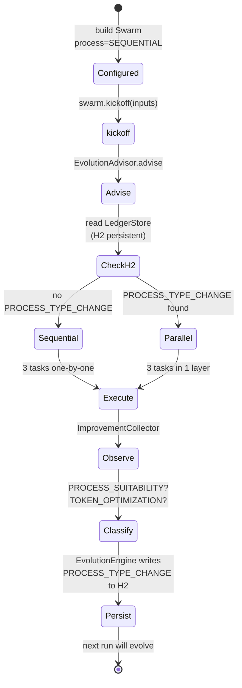

# Self-Evolving Swarm

A swarm that quietly rewrites its own execution topology between runs. The example always builds three independent research tasks as `ProcessType.SEQUENTIAL`, but `Swarm.kickoff()` consults an evolution advisor backed by an H2 store — if a prior run observed that the tasks were parallelisable, the framework transparently switches to `PARALLEL` on the next invocation. No code changes, ~40-60% faster.

## Architecture



## What You'll Learn

- Building a multi-agent `Swarm` with `Swarm.builder()` and `ProcessType.SEQUENTIAL`
- How `Swarm.kickoff()` consults the evolution advisor and applies persisted optimizations before execution
- Reading evolution history via `LedgerStore.getRecentEvolutions(int)` and `StoredEvolution`
- Wiring `WorkflowMetricsCollector.metricsHook()` into `Agent.builder().toolHook(...)` for observation collection
- Using `PermissionLevel.READ_ONLY` to constrain agent tool access
- The internal vs external observation taxonomy (`PROCESS_SUITABILITY`, `EXPENSIVE_TASK`, `CONVERGENCE_PATTERN`, `TOOL_SELECTION` are applied at runtime; failure / anti-pattern / decision-quality observations are recorded locally only)

## Prerequisites

- Java 21
- An LLM backend — Ollama running locally (default model `mistral`) or the `openai-mini` Spring profile with `OPENAI_API_KEY` set
- No additional API keys required for the default profile
- SwarmAI 1.0.24
- H2 storage directory writable (defaults to the working directory)

## Run

```bash
# Run 1: SEQUENTIAL (learns)
./self-evolving-swarm/run.sh "AI orchestration"

# Run 2: PARALLEL (transparently applied by Swarm.kickoff())
./self-evolving-swarm/run.sh "AI orchestration"
```

`run.sh` delegates to the root `./run.sh self-evolving "$@"` driver.

## How It Works

The workflow defines three analyst agents (Technology, Market, Risk), each with `maxTurns=1` and `PermissionLevel.READ_ONLY`, and three corresponding 200-word analysis tasks. The swarm is always constructed with `ProcessType.SEQUENTIAL`. When `swarm.kickoff(...)` runs, it asks the `EvolutionAdvisor` whether the `LedgerStore` already contains a `PROCESS_TYPE_CHANGE` evolution for this swarm id; if so, the framework rewrites the process type to `PARALLEL` before executing. After execution, the self-improvement phase fires asynchronously: `ImprovementCollector` records observations (e.g. `PROCESS_SUITABILITY` — "3 independent tasks at depth 0, parallel may reduce latency"), `EvolutionEngine` classifies them and persists qualifying evolutions to H2. On the next run, that persisted evolution flips the topology — same code, ~40-60% lower wall-clock duration.

## Key Code

```java
// Always built as SEQUENTIAL. Swarm.kickoff() will transparently switch
// to PARALLEL if the evolution advisor finds a PROCESS_TYPE_CHANGE in H2.
WorkflowMetricsCollector metrics = new WorkflowMetricsCollector("self-evolving");

Agent analyst1 = Agent.builder()
        .role("Technology Analyst").goal("Analyze the technology landscape for " + topic)
        .backstory("Senior technology analyst specializing in emerging tech trends.")
        .chatClient(chatClient).maxTurns(1)
        .permissionMode(PermissionLevel.READ_ONLY)
        .toolHook(metrics.metricsHook()).build();
// ... analyst2 (Market), analyst3 (Risk) built the same way ...

Swarm swarm = Swarm.builder()
        .id("self-evolving-swarm")
        .agent(analyst1).agent(analyst2).agent(analyst3)
        .task(techTask).task(marketTask).task(riskTask)
        .process(ProcessType.SEQUENTIAL)   // <-- never changes
        .eventPublisher(eventPublisher)
        .build();

SwarmOutput output = swarm.kickoff(Map.of("topic", topic));

// Inspect what the framework learned
List<LedgerStore.StoredEvolution> evolutions = ledgerStore.getRecentEvolutions(10);
```

## Customization

- Change the `topic` argument or substitute different analysis dimensions (legal, compliance, sustainability, ...) by adding more `Agent` + `Task` pairs
- Increase `maxTurns` per agent to allow tool use; observations may then surface `TOOL_SELECTION` evolutions
- Inspect the live evolution timeline via the Studio UI at `GET /evolution.html` and the JSON API at `GET /api/studio/evolutions`
- Clear `~/.swarmai/h2` (or the configured H2 directory) to reset the evolution history and watch the cold-start arc again
- Swap `PermissionLevel.READ_ONLY` for `EXECUTE` or `WRITE` if you give the agents mutating tools — combined with the evolution engine, this exposes `TOOL_SELECTION` learning

## Internal vs External Observations

| Routing      | Types                                                                          | Action                                       |
|--------------|--------------------------------------------------------------------------------|----------------------------------------------|
| **INTERNAL** | `PROCESS_SUITABILITY`, `EXPENSIVE_TASK`, `CONVERGENCE_PATTERN`, `TOOL_SELECTION` | `EvolutionEngine` applies at next runtime    |
| **EXTERNAL** | `FAILURE`, `ANTI_PATTERN`, `DECISION_QUALITY`, `COORDINATION_QUALITY`            | Recorded locally; submission is opt-in       |

Internal observations drive runtime adjustments using existing framework capabilities. External observations record structural gaps for later review and do not trigger automatic re-wiring.
