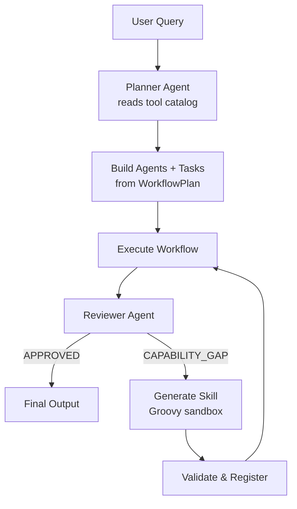

# Self-Improving Workflow

Fully dynamic, config-driven workflow that plans its own agents and tasks at runtime, executes them, identifies capability gaps, generates new skills, and re-executes with an expanded toolkit until quality converges.

## Architecture



## What You'll Learn

- SELF_IMPROVING process type: plan, execute, gap-analyze, generate skills, re-execute
- LLM-driven workflow planning from a user query and enriched tool catalog
- Config-driven architecture via WorkflowProperties (no hardcoded model names, temperatures, or timeouts)
- Tool health checking with ToolHealthChecker.filterOperational() before agent assignment
- Enriched tool catalog with routing metadata (category, triggerWhen, avoidWhen, tags)
- Known-good API endpoints and safe scrape URLs from configuration
- Dynamic skill generation (CODE, HYBRID, COMPOSITE) with integration tests
- Convergence detection for automatic stopping

## Prerequisites

- Ollama running locally (or OpenAI/Anthropic API key configured)
- Configuration in `application.yml` under `swarmai.workflow.*`:
  - `model`, `maxIterations`, `verbose`, `maxRpm`, `language`
  - Agent definitions: `agents.planner`, `agents.analyst`, `agents.writer`, `agents.reviewer`
  - Task timeouts: `tasks.planning`, `tasks.analysis`, `tasks.report`
  - `knownEndpoints` for real API URLs (Wikipedia, GitHub, Hacker News)
  - `scrapeSafeUrls` for web scraping targets

## Run

```bash
./run.sh self-improving "Analyze AAPL stock performance"
./run.sh self-improving "Compare cloud providers AWS vs Azure vs GCP"
./run.sh self-improving "AI agent frameworks market analysis 2026"
```

## How It Works

Given any user query, a Planner agent reads the enriched tool catalog (with routing hints and known-good API endpoints) and generates a structured WorkflowPlan specifying the analyst's role, goal, backstory, recommended tools, task descriptions, and quality criteria. The framework then builds agents and tasks from this plan plus externalized config (WorkflowProperties). A self-improving loop begins: the Analyst executes using the selected tools, the Writer produces a report, and a QA Director reviews the output. The reviewer distinguishes between QUALITY_ISSUES (agents should use existing tools better) and CAPABILITY_GAPS (genuinely missing tools). Quality issues trigger re-execution with feedback; capability gaps trigger skill generation. The loop continues until the reviewer approves or convergence is detected.

## Key Code

```java
// Phase 1: LLM plans the workflow from query + tool catalog
String toolCatalog = buildEnrichedToolCatalog(tools);
WorkflowPlan plan = generatePlan(chatClient, query, toolCatalog, metrics);

// Phase 3: Self-improving loop with dynamic skill generation
Swarm swarm = Swarm.builder()
        .id("self-improving-analysis")
        .agent(analyst)
        .agent(writer)
        .managerAgent(reviewer)
        .process(ProcessType.SELF_IMPROVING)
        .config("maxIterations", config.getMaxIterations())
        .config("qualityCriteria", plan.qualityCriteria)
        .build();
```

## Output

- Report file at the path configured in `swarmai.workflow.output.reportFile` (typically `output/self_improving_report.md`)
- Console output includes:
  - LLM-generated plan details (analyst role, goal, recommended tools)
  - Skills generated, skills reused, total iterations, stop reason
  - Skill registry statistics
  - Full token usage summary

## Customization

- All parameters are externalized to `application.yml` under `swarmai.workflow.*` -- no code changes needed
- Add new tools by registering them as Spring beans; they auto-appear in the tool catalog
- Configure `knownEndpoints` in YAML to add domain-specific APIs for the planner to recommend
- Adjust `maxCapabilityGapsPerReview` and `maxNextCommandsPerReview` in planning config
- Set `tools` list in config to restrict which tools are available (empty = all tools)
- Override per-agent model names for mixed-model workflows (e.g., GPT-4 for planning, Mistral for execution)

## YAML DSL

This workflow can also be defined declaratively in YAML. See [`workflows/self-improving.yaml`](src/main/resources/workflows/self-improving.yaml):

```bash
# Load and run via YAML instead of Java
Swarm swarm = swarmLoader.load("workflows/self-improving.yaml",
    Map.of("topic", "market analysis"));
SwarmOutput output = swarm.kickoff(Map.of());
```

The YAML definition includes self-improving process with dynamic capability expansion.
