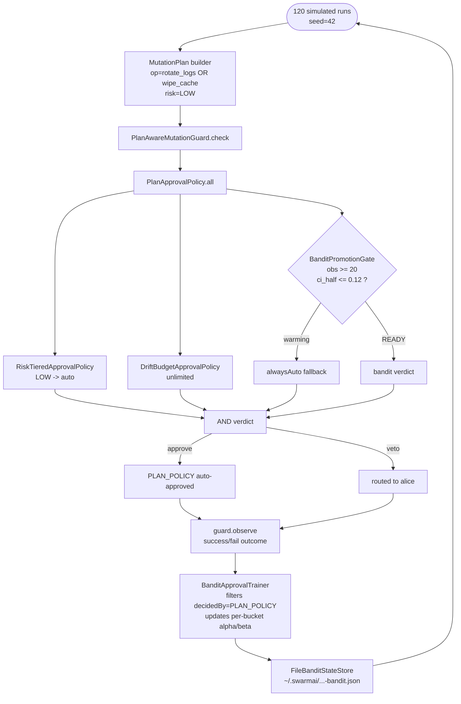

# Self-Improving Plan Loop

The closed loop that proves SwarmAI's "stateful learning harness" claim. Two LOW-risk action buckets are indistinguishable to the static policy rules (`RiskTier` + `DriftBudget`), but a Thompson-sampling bandit attached as a third veto observes per-bucket success rates and learns the asymmetry. Once a bucket has enough evidence, the bandit graduates and vetoes auto-approval — visibly changing workflow decisions across runs with no code changes, persisting state to disk between sessions.

## Architecture



## What You'll Learn

- Composing policies with `PlanApprovalPolicy.all(RiskTieredApprovalPolicy, DriftBudgetApprovalPolicy, BanditPromotionGate)`
- Configuring `BanditPromotionGate` with `minObs=20` and `maxCiHalfWidth=0.12` and an `alwaysAuto` fallback
- Wiring `BanditApprovalTrainer.attach(channel, bandit)` so the bandit learns from observed transitions
- Persisting and restoring bandit state via `FileBanditStateStore`, `bandit.snapshot()`, `bandit.restore(...)`
- Using `PlanAwareMutationGuard` and `MutationPlan.builder()` with operation types as bucket keys
- Why the trainer filters `decidedBy=PLAN_POLICY` — to avoid poisoning the model with operator-routed runs

## Prerequisites

- Java 21
- SwarmAI 1.0.24
- No LLM calls are made. The simulation is deterministic with seed 42.
- Writable `~/.swarmai/` directory for the persisted bandit state file

## Run

```bash
./run.sh self-improving-plan-loop
# or equivalently
./self-improving-plan-loop/run.sh

# Reset persisted learning and watch the graduation arc again
rm ~/.swarmai/self-improving-plan-loop-bandit.json
./run.sh self-improving-plan-loop
```

## How It Works

The example seeds the static `RiskTieredApprovalPolicy` with one MEDIUM-risk action so the LOW-risk simulation can flow through auto-approval. It then drives 120 simulated runs (60 per bucket) interleaving `rotate_logs` (underlying P(success) = 0.95) and `wipe_cache` (P(success) = 0.10). Each plan goes through `PlanAwareMutationGuard.check(...)`; the composed policy AND-combines `RiskTier`, `DriftBudget`, and `BanditPromotionGate`. Pre-graduation, the gate's `alwaysAuto` fallback collapses the AND to "static decides." `BanditApprovalTrainer` silently feeds outcomes back into the bandit, partitioned by the bucket key `tool:deploy:LOW:<op>`. Around run 40 the `wipe_cache` bucket hits `obs >= 20` and `ci_half <= 0.12`; the gate flips to READY, the bandit's verdict joins the AND, and every subsequent `wipe_cache` is vetoed (`decidedBy=alice`). `rotate_logs` graduates too but keeps auto-approving because its mean is ~0.95. On exit, `bandit.snapshot()` writes to `~/.swarmai/self-improving-plan-loop-bandit.json`; the next run loads it, and slowpath is vetoed from row 1.

## Key Code

```java
InMemoryPlanChannelAccessor channel = new InMemoryPlanChannelAccessor();

// Bucket key includes the operation type so fastpath / slowpath are distinct.
BanditApprovalPolicy bandit = new BanditApprovalPolicy(
        e -> "tool:" + TOOL + ":" + e.risk() + ":" + opOf(e),
        /*warmup*/ 0);

BanditStateStore store = new FileBanditStateStore(stateFile);
bandit.restore(store.load());                       // load prior learning
BanditApprovalTrainer.attach(channel, bandit);      // feed outcomes back

BanditPromotionGate banditGate = new BanditPromotionGate(
        bandit,
        PlanApprovalPolicy.alwaysAuto(),            // fallback while warming
        /*minObs*/ 20,
        /*maxCiHalfWidth*/ 0.12);

PlanApprovalPolicy policy = PlanApprovalPolicy.all(
        new RiskTieredApprovalPolicy(),
        new DriftBudgetApprovalPolicy(Integer.MAX_VALUE),
        banditGate);

PlanAwareMutationGuard guard = new PlanAwareMutationGuard(humanDelegate, channel, policy);

// ... drive 120 simulated runs ...
store.save(bandit.snapshot());                      // persist for next session
```

## Customization

- Tune `minObs` and `maxCiHalfWidth` on `BanditPromotionGate` — lower thresholds graduate faster but with weaker confidence
- Change `RUNS_PER_BUCKET`, `FASTPATH_RATE`, `SLOWPATH_RATE`, or `SEED` to explore different convergence profiles
- Change the bucket-key function to partition by other dimensions (per-environment, per-region, per-tool) and observe per-partition graduation
- Replace `InMemoryPlanChannelAccessor` with `AgentStateBackedPlanChannelAccessor` to integrate into a real swarm's `AgentState`
- Swap the deterministic simulator for real tool calls (`WindowsFileSystemTool`, etc.) and an `LlmReplanner` like the one in `plan-loop` — the rest of the wiring is unchanged

## Why This Example Matters

| Example                | Covers                                                        | Doesn't cover                                  |
|------------------------|---------------------------------------------------------------|------------------------------------------------|
| `plan-loop`            | Workflow machinery, real LLM, subagents, replanner            | Bandit influencing decisions; learning applied |
| `bandit-learning`      | Thompson Sampling convergence, promotion gate, snapshot/restore | Real workflow; closed-loop application         |
| **this example**       | Both halves wired together: bandit composed into policy, learning persisted, decisions visibly change across runs |                                                |

The slowpath veto is the visible self-improvement: the policy chain produces different verdicts for the same input on day 2 because the bandit's evidence from day 1 carries forward via `FileBanditStateStore`. Same code, same input, demonstrably better output.
