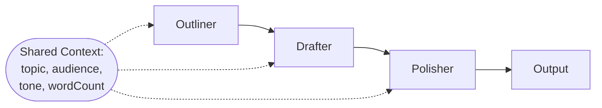

# Shared Context Between Agents

Three agents in a pipeline — Outliner, Drafter, Polisher — all sharing context through the inputs map.

## Architecture



## What You'll Learn

- Pass shared state across multiple agents via `swarm.kickoff(inputs)`
- Build multi-stage pipelines with `dependsOn` chaining
- Use context variables in task descriptions

## Run

```bash
./shared-context-between-agents/run.sh
# or
./run.sh context-variables "microservices architecture"
```

## Key Concepts

- **Inputs map** — a `Map<String, Object>` passed to `swarm.kickoff()` carrying shared state.
- **String interpolation** — task descriptions use `String.format` to inject context variables.
- **`dependsOn` chaining** — `outlineTask -> draftTask -> polishTask` forms a three-stage pipeline.
- Each agent sees only the previous task's output plus the interpolated context, not the full history.

## Source

- [`ContextVariablesExample.java`](src/main/java/ai/intelliswarm/swarmai/examples/basics/ContextVariablesExample.java)
