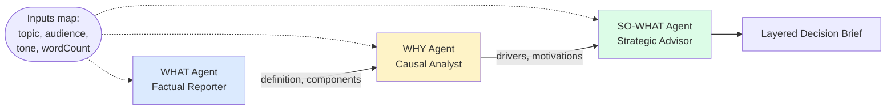

# Shared Context Between Agents

Three agents share the same `inputs` map (topic, audience, tone, word count) but each has a **strictly different reasoning scope**: **WHAT** the thing is, **WHY** it exists, and **SO WHAT** the audience should do. The result is a layered decision brief that's noticeably better than what one mega-prompt produces.

> **The lesson:** mega-prompts that mix description, causation, and prescription quietly produce the worst output of the three. Splitting into separate agents with sharply scoped goals — and sharing context via `inputs` instead of bolting it into each prompt — is one of the highest-leverage moves in agent design.

## Architecture



Each agent's `goal` field includes "**STRICT SCOPE**" rules — the WHY agent is explicitly forbidden from re-describing what the topic is, and the SO-WHAT agent is forbidden from re-explaining causes. This is what keeps the layers from blurring.

## Run

```bash
./shared-context-between-agents/run.sh
# or with your own topic
./run.sh context-variables "microservices architecture"
./run.sh context-variables "event sourcing"
./run.sh context-variables "Rust for backend services"
```

## What you get

```text
$ ./run.sh context-variables "event sourcing"

=== WHAT (Factual Reporter) ===
Event sourcing is an architectural pattern where state changes are recorded as
an append-only log of immutable events. Components: an event store, a command
handler, an event log...

=== WHY (Causal Analyst) ===
Event sourcing emerged from the convergence of three pressures: regulators
demanding auditability, microservices needing decoupled state propagation,
and the operational cost of state-loss bugs in CRUD architectures...

=== SO WHAT (Strategic Advisor) ===
For senior engineers evaluating event sourcing in 2026:
  1. Use it where audit trails are first-class business requirements...
  2. Avoid it for low-volume CRUD with no compliance pressure...
  3. Watch for: replay performance, snapshot strategy, schema evolution...
```

Notice how each layer pulls its weight without re-treading the others.

## The "mega-prompt" failure case

Try collapsing all three goals into a single agent:

```java
Agent monolith = Agent.builder()
    .goal("Describe WHAT it is, explain WHY it exists, and tell the audience SO WHAT to do")
    ...
```

You'll see consistent failure modes:
- **Topic drift** — the agent re-describes the topic mid-recommendation
- **Hedge soup** — every claim gets wrapped in "depending on context" because the agent doesn't know whose question it's answering
- **Truncation bias** — under length budgets, the prescriptive layer (most valuable to the audience) gets squeezed first

Splitting into three agents with strict scopes fixes all three because each agent's prompt is *smaller* and *more pointed*. That's the win.

## What you'll learn

- **Inputs map** — `Map<String, Object>` passed to `swarm.kickoff()` carrying shared state. Each task description interpolates from it via `String.format` so changing audience/tone updates all three agents at once.
- **Scope discipline** — the magic isn't in the inputs plumbing; it's in writing `goal` and `backstory` fields that say "do this, **never that**." Each agent in this example has at least one explicit "do not" clause.
- **`dependsOn` chaining** — `whatTask -> whyTask -> soWhatTask`. Each agent sees only the previous task's output plus the interpolated context.
- **When to use this vs. one agent** — if your task naturally splits into 2-3 reasoning modes (describe vs. explain vs. recommend), separating them almost always improves quality. If it's a single mode (just-describe, just-classify), one agent is fine.

## Source

- [`ContextVariablesExample.java`](src/main/java/ai/intelliswarm/swarmai/examples/basics/ContextVariablesExample.java)

## See also

- [`agent-to-agent-task-handoff`](../agent-to-agent-task-handoff/) — same pattern with two agents, no shared inputs map.
- [`evaluator-optimizer-feedback-loop`](../evaluator-optimizer-feedback-loop/) — adds a quality gate after the SO-WHAT layer.
- [`multi-turn-deep-reasoning`](../multi-turn-deep-reasoning/) — the opposite trade-off: one agent, many turns, one rich output.
