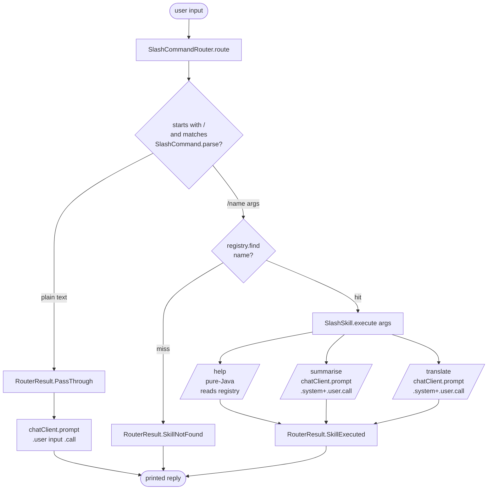

# Slash Commands

Familiar `/<name> [args]` UX for agent harnesses. The `SlashCommandRouter` inspects every user input deterministically before any LLM call, routes registered slash commands to their `SlashSkill` action (pure-Java or LLM-backed), surfaces a clear "not found" for unknown slashes, and lets plain text pass through to the chat client unchanged.

## Architecture



## What You'll Learn

- Registering skills with `SlashSkillRegistry.register(SlashSkill)` and the built-in `HelpSkill.of(registry)`
- Constructing custom `SlashSkill`s as `(name, description, Function<String,String> action)` records
- Routing user input through `SlashCommandRouter.route(String)` and switching on the sealed `RouterResult` (`SkillExecuted`, `SkillNotFound`, `PassThrough`)
- Building LLM-backed skills by capturing a Spring AI `ChatClient` in the action closure (`chatClient.prompt().system(...).user(...).call().content()`)
- Why slash routing is deterministic and pre-LLM — unknown commands don't burn a turn
- How `/help` stays honest by reading the same `SlashSkillRegistry` it is registered in

## Prerequisites

- Java 21
- SwarmAI 1.0.24 (slash-command harness available since 1.0.19)
- An LLM backend: `OPENAI_API_KEY` in the parent `.env` (default), or activate the Ollama profile
- No additional configuration for `/help` (pure-Java) — only `/summarise`, `/translate`, and the plain-text passthrough make LLM calls

## Run

```bash
# Default 5-input transcript that exercises every routing branch
./slash-commands/run.sh

# Single-input mode
./slash-commands/run.sh "/summarise <your text>"
```

`run.sh` delegates to the root `./run.sh slash-commands "$@"` driver.

## How It Works

`SlashCommandsExample` builds a `SlashSkillRegistry`, registers three skills (`/help`, `/summarise`, `/translate`), and constructs a `SlashCommandRouter` in front of it. It then iterates over a fixed five-input transcript (or `args` if supplied) so the demo is reproducible. Each input is passed to `router.route(input)`, which returns a sealed `RouterResult`. A switch expression handles each variant: `SkillExecuted` prints the skill's output, `SkillNotFound` prints "unknown command", and `PassThrough` calls the `ChatClient` directly. `/help` is implemented in pure Java and lists every skill currently in the registry; `/summarise` and `/translate` capture the `ChatClient` in their action closure and delegate to the LLM with focused system prompts. After the transcript runs, a quality-check phase asserts that every routing branch was exercised, `/help` listed all skills, and the LLM-backed skills produced non-trivial output that actually differs from the input.

## Key Code

```java
SlashSkillRegistry registry = new SlashSkillRegistry();
registry.register(HelpSkill.of(registry));   // pure-Java, reads the registry

registry.register(new SlashSkill("summarise",
        "summarise a passage of text in 1-2 sentences",
        argsText -> {
            if (argsText == null || argsText.isBlank()) return "Usage: /summarise <text>";
            return chatClient.prompt()
                    .system("You are a terse editor. Summarise the user's passage "
                            + "in 1-2 short sentences. Plain prose, no markdown.")
                    .user(argsText)
                    .call().content();
        }));

SlashCommandRouter router = new SlashCommandRouter(registry);

String output = switch (router.route(input)) {
    case RouterResult.SkillExecuted e -> "[skill: /" + e.skillName() + "]\n" + e.output();
    case RouterResult.SkillNotFound n -> "[unknown command: /" + n.name() + "]";
    case RouterResult.PassThrough p   -> "[passthrough]\n" + chatClient.prompt()
                                          .user(p.input()).call().content();
};
```

## Customization

- Register your own skills — any `Function<String,String>` is a valid action body (pure logic, LLM-backed, tool-bridge, stateful counter, ...)
- Capture additional collaborators in the action closure (a `BaseTool`, a `TaskList`, a `SystemReminderChannel`) to build `/tasks`, `/notify`, `/run <tool>` style commands
- Change the system prompts on `/summarise` and `/translate` to target a different domain or tone
- Replace the fixed transcript with a real REPL loop: feed `Scanner.nextLine()` to `router.route(...)` and print the result
- Pre-populate the registry from configuration or a discovery scan so application code only writes the new skills

## Default Transcript

The default five inputs cover every routing branch exactly once:

| # | Input                              | Expected route             |
|---|------------------------------------|----------------------------|
| 1 | `/help`                            | `SkillExecuted` (pure Java)|
| 2 | `/summarise <passage>`             | `SkillExecuted` (LLM)      |
| 3 | `/translate French Hello, world!`  | `SkillExecuted` (LLM)      |
| 4 | `/nonexistent something`           | `SkillNotFound`            |
| 5 | `Tell me a haiku about coffee.`    | `PassThrough` -> LLM       |

## Composing Skills With Other Primitives

Skills can capture any harness state in their action closure. Common patterns:

- **LLM-backed skill** — capture a `ChatClient`, call `chatClient.prompt()...`
- **Stateful skill** — capture a counter, registry, or session map and mutate per call
- **Tool-bridge skill** — invoke a `BaseTool` directly and format the result
- **TaskList skill** — capture a `TaskList` and let `/tasks` dump the current state
- **Reminder-driven skill** — capture a `SystemReminderChannel` and let `/notify <msg>` queue a reminder for the next turn

The pattern is identical in each case: `Function<String, String>` is the entire skill body.
