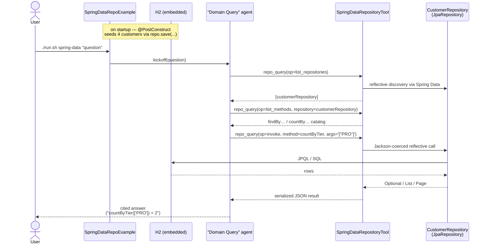

# Spring Data Repository Agent Example

> **New to SwarmAI?** Start from the [quickstart template](../quickstart-template/) for the
> minimum viable app, then swap `WikipediaTool` → `SpringDataRepositoryTool` and define your own
> `JpaRepository` / `@Entity`. This directory shows the full Customer seeding + triage prompt.


Exercises **`SpringDataRepositoryTool`** — the Java-native differentiator that reflectively
exposes every `JpaRepository` in the running Spring context as an agent-callable tool.
A domain-query agent inspects the repo, picks the right finder method, and calls it to answer
business questions.

This example ships its own JPA entity (`Customer`) + repo (`CustomerRepository`) and seeds 4 rows
into an embedded H2 database on startup — a proxy for what adoption would look like in any real
Spring Boot app.

## How it works



## Prerequisites

**API keys / env vars:** none. The whole example runs in-process.

**Infrastructure:** none — H2 is embedded. The same pattern applies to Postgres / MySQL /
any DB Spring Data JPA supports; only the Maven dep + DataSource config differ.

## Run

```bash
./run.sh spring-data
./run.sh spring-data "how many customers are on the PRO tier?"
./run.sh spring-data "find customers with lifetime spend over $10,000"
```

## What to expect

The agent enumerates the app's `JpaRepository` beans, lists the finder methods exposed by
`CustomerRepository`, picks the right one for the question (e.g. `countByTier`,
`findBySpendGreaterThan`), and invokes it against the seeded H2 rows to answer in natural
language.

## Value add

Every Spring Boot shop already has `JpaRepository` interfaces that model their domain.
With this tool, adoption becomes "add `swarmai-tools` to your classpath and your agents can
now query your whole data layer" — a capability **no Python agent framework can match**,
because JPA is a JVM construct.

## What this proves about the tool

- `list_repositories` enumerates `customerRepository` with its interface + entity type
  (resolved via Spring Data's `RepositoryFactoryInformation`, not via interface-walking guesses).
- `list_methods` shows every `findBy…` / `countBy…` / inherited `findAll`, while hiding
  `save*` / `delete*` methods by default (`allow_writes=true` opts them in).
- `invoke` dispatches by method name + arity, coerces JSON args to the declared parameter types
  via Jackson, unwraps `Optional<T>`, serialises `Iterable`/`Page` to JSON for the agent.
- Write methods (e.g. `deleteAll`) are refused without an explicit `allow_writes=true` — a guard
  the agent can reason about when deciding whether to escalate.

## Why this matters for adoption

Every Spring Boot shop has dozens of `JpaRepository` interfaces already modelling their domain.
With this tool, adoption becomes "add `swarmai-tools` to your classpath and your agents can now
query your whole domain" — a capability **no Python agent framework can match**, because JPA is
a JVM construct.
