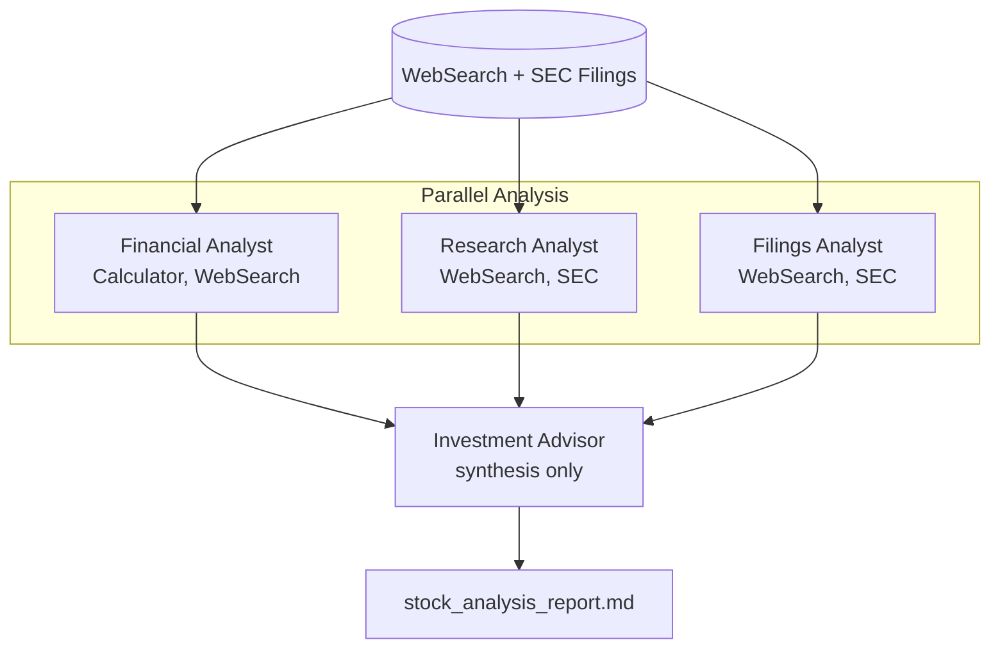

# Stock Analysis Workflow

Multi-agent financial analysis pipeline that produces an investment recommendation grounded in SEC filings and web research.

## Architecture



## What You'll Learn

- Parallel process type with automatic dependency resolution
- Tool health checking and filtering before agent assignment
- Tool routing metadata (category, triggerWhen, avoidWhen, tags)
- Pre-fetched tool evidence shared across agents to reduce redundant API calls
- Observability features: decision tracing, event store, workflow recording
- Anti-hallucination guardrails via strict data grounding rules
- Budget tracking and metrics collection

## Prerequisites

- Ollama running locally (or OpenAI/Anthropic API key configured)
- Optional: `ALPHA_VANTAGE_API_KEY` for richer web search data
- Optional: `EODHD_API_KEY` (free tier at https://eodhd.com/) — when set, the
  financial analyst pulls 30-day OHLCV and the RSI(14) trend, and the research
  analyst pulls upcoming earnings and analyst-rating trends from EODHD's calendars.
  When unset, both agents skip those sections cleanly.
- Optional: Observability components enabled in `application.yml`

## Run

```bash
./run.sh stock-analysis AAPL
./run.sh stock-analysis TSLA
./run.sh stock-analysis NVDA
```

## How It Works

The workflow pre-fetches tool evidence from WebSearch, SEC EDGAR, and Finnhub, then passes it to three specialist agents running in parallel. The Financial Analyst extracts metrics and ratios — and, when `EODHD_API_KEY` is configured, calls `eodhd_market_data` for a 30-day OHLCV summary and the RSI(14) trend. The Research Analyst gathers news and sentiment and uses `eodhd_discovery` for upcoming earnings dates and analyst-rating trends. The Filings Analyst reviews SEC filings for trends and insider activity. All three streams feed into an Investment Advisor who synthesizes the findings into a final BUY/HOLD/SELL recommendation with a confidence level. Every claim must cite its source, and missing data must be declared explicitly rather than estimated.

## Key Code

```java
// Parallel process: 3 independent streams + 1 synthesis
Swarm stockAnalysisSwarm = Swarm.builder()
        .id("stock-analysis-swarm")
        .agent(financialAnalyst)
        .agent(researchAnalyst)
        .agent(investmentAdvisor)
        .task(financialAnalysisTask)    // Layer 0 (parallel)
        .task(researchTask)             // Layer 0 (parallel)
        .task(filingsAnalysisTask)      // Layer 0 (parallel)
        .task(recommendationTask)       // Layer 1 (depends on all 3)
        .process(ProcessType.PARALLEL)
        .budgetTracker(metrics.getBudgetTracker())
        .budgetPolicy(metrics.getBudgetPolicy())
        .build();
```

## Output

- `output/stock_analysis_report.md` -- Final investment recommendation with:
  - Executive summary with BUY/HOLD/SELL rating and confidence level
  - Financial metrics table with sources
  - Market and news assessment
  - SEC filings assessment
  - Risk/reward matrix with likelihood and impact
  - Data gaps and confidence impact section
- Console logs with token usage summary, duration, and observability timeline

## Customization

- Change the target stock by passing a different ticker symbol as the first argument
- Adjust agent temperature values for more/less creative analysis
- Add additional tools (e.g., a dedicated stock price API tool) to the financialTools or researchTools lists
- Modify `MAX_EVIDENCE_PER_SOURCE` (default 15000 chars) to control context window usage
- Enable decision tracing in `application.yml` for full audit trails
- Switch from `ProcessType.PARALLEL` to `ProcessType.SEQUENTIAL` for debugging

## YAML DSL

This workflow can also be defined declaratively in YAML. See [`workflows/stock-analysis.yaml`](src/main/resources/workflows/stock-analysis.yaml):

```java
// Load and run via YAML instead of Java
Swarm swarm = swarmLoader.load("workflows/stock-analysis.yaml",
    Map.of("ticker", "AAPL"));
SwarmOutput output = swarm.kickoff(Map.of());
```

The YAML definition includes tools, compaction config, and sequential financial analysis.
