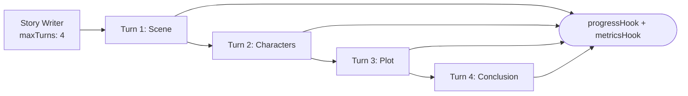

# Streaming Agent Output

Long-form content shouldn't arrive as a single 30-second blob. This story writer runs across 4 turns, surfacing scene → characters → plot → conclusion incrementally, with `ToolHook` callbacks firing on every step so you can wire them straight into a UI progress bar or a server-sent-events stream. Conversation compaction keeps the context window bounded as turns accumulate.

## Architecture



## What You'll Learn

- Multi-turn agent execution with `Agent.builder().maxTurns(4)` for phased output
- Conversation compaction via `CompactionConfig.of(2, 3000)` to manage context across turns
- Using `ToolHook` as a streaming progress observer (beforeToolUse / afterToolUse)
- Inspecting turn-by-turn output with `SwarmOutput.getTaskOutputs()` including per-turn token counts
- Budget tracking and metrics collection with `WorkflowMetricsCollector`

## Prerequisites

- Ollama with `mistral:latest` (or any configured model)
- No additional API keys required

## Run

```bash
# Default topic: "a robot discovering emotions"
./run.sh streaming

# Custom topic
./run.sh streaming "a detective solving a mystery in space"
```

## How It Works

A single `Agent` (Creative Story Writer) builds a short story in four phases -- scene, characters, plot, and conclusion -- using `maxTurns(4)`. Each turn produces a labeled section with `<CONTINUE>` / `<DONE>` signals. A `CompactionConfig` summarizes older turns when token counts grow, keeping the most recent context in full. Two `ToolHook` instances observe execution: a progress hook that logs the current phase, and a metrics hook that tracks tool call timing. After execution, `SwarmOutput.getTaskOutputs()` provides per-turn content and token usage.

## Key Code

```java
// Multi-turn agent with compaction and streaming hooks
Agent storyWriter = Agent.builder()
        .role("Creative Story Writer")
        .goal("Write a compelling short story by building it incrementally...")
        .chatClient(chatClient)
        .maxTurns(4)
        .compactionConfig(CompactionConfig.of(2, 3000))
        .permissionMode(PermissionLevel.READ_ONLY)
        .toolHook(metrics.metricsHook())
        .toolHook(progressHook)
        .temperature(0.7)
        .build();

// Inspect turn-by-turn output after execution
List<TaskOutput> outputs = result.getTaskOutputs();
for (int i = 0; i < outputs.size(); i++) {
    TaskOutput output = outputs.get(i);
    logger.info("Turn {} -- tokens: {}/{}, content: {}",
            i + 1, output.getPromptTokens(),
            output.getCompletionTokens(), output.getRawOutput());
}
```

## Customization

- Change the number of phases by adjusting `maxTurns()` and the task description
- Tune `CompactionConfig.of(keepTurns, maxTokens)` to control how aggressively history is summarized
- Add more `ToolHook` instances for custom logging, metrics, or event publishing
- Adjust `temperature(0.7)` for more or less creative output

## YAML DSL

This workflow can also be defined declaratively in YAML. See [`workflows/streaming.yaml`](src/main/resources/workflows/streaming.yaml):

```bash
# Load and run via YAML instead of Java
Swarm swarm = swarmLoader.load("workflows/streaming.yaml",
    Map.of("topic", "a journey through time"));
SwarmOutput output = swarm.kickoff(Map.of());
```

The YAML definition includes multi-turn story building with workflow hooks for progress tracking.
