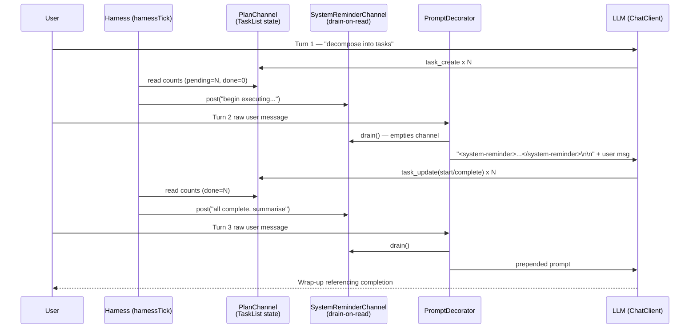

# System Reminders

The harness watches an agent's task list and posts terse runtime notes — "you have 6 pending tasks, start executing", "all tasks complete, summarise" — between turns. The agent never sees those notes as separate messages; instead they are drained and prepended into the next user prompt as `<system-reminder>` blocks, so guidance arrives exactly when the LLM is about to act on it.

## Architecture



## What You'll Learn

- Wiring a `SystemReminderChannel` alongside an `InMemoryPlanChannelAccessor` so state and harness messages stay in separate primitives
- Draining and rendering reminders with `SystemReminderPromptDecorator.prepend(userMessage)`
- Posting one-shot vs. recurring nudges via `channel.post(...)`, `channel.postWarn(...)`, and `channel.postOnce(...)`
- Driving a multi-turn conversation manually with `List<Message>` so reminders can be injected per-turn
- Reading derived `TaskList` state (`pendingTasks()`, `inProgressTasks()`, `completedTasks()`) to decide what to post
- Mirroring channel listeners (`planChannel.addListener`, `reminderChannel.addListener`) to make the run observable

## Prerequisites

- Java 21
- `OPENAI_API_KEY` in the parent `.env` file (or switch provider with `SPRING_PROFILES_ACTIVE=ollama` / `openai-mini`)
- swarmai 1.0.24

## Run

```bash
# default: Tokyo trip planning prompt
./system-reminders/run.sh

# custom goal
./system-reminders/run.sh "Plan a v2.0 release for an open-source library"
```

## How It Works

The example runs a three-turn conversation manually so the harness can inspect state between turns. Turn 1 asks the agent to decompose a goal into 5-7 tasks via `task_create`, but explicitly forbids execution. Between turns the `harnessTick` method examines `TaskList` derived state — pending count, in-progress count, completed count — and posts reminders into a `SystemReminderChannel`. Before sending Turn 2, `SystemReminderPromptDecorator.prepend` drains every queued reminder and wraps them in a `<system-reminder>` block prepended to the user message. The agent's Turn 2 reply now executes the plan (start → work → complete for each task). Another harness tick fires the "all complete, summarise" reminder, which steers Turn 3 into a wrap-up. A final quality check verifies at least two reminders were posted, both later turns contained reminder blocks, all tasks reached terminal status, and Turn 3's reply mentions completion or summary keywords.

## Key Code

```java
SystemReminderChannel reminderChannel = new SystemReminderChannel();
SystemReminderPromptDecorator decorator = new SystemReminderPromptDecorator(reminderChannel);

// Between turns: examine TaskList state and post a directive nudge
if (pending > 0 && inProgress == 0 && done == 0) {
    reminderChannel.post("task-list",
            "You have " + pending + " pending tasks and none in progress. "
                    + "Begin executing them one at a time using task_update.");
}

// Before the next LLM call: drain + render + prepend in one step
String turn2User = decorator.prepend(turn2RawUser);
history.add(new UserMessage(turn2User));   // contains <system-reminder>...</system-reminder>
```

## Customization

- Change the `harnessTick` thresholds (e.g. `total >= 7`) to fire reminders for different plan sizes
- Add new sources beyond `"task-list"` — drift budget, replanner activation, time-of-day — each is just another `channel.post(source, message)` call
- Swap `channel.post` for `channel.postWarn` to mark reminders as WARN severity (rendered with a visible tag)
- Use `channel.postOnce(source, message)` to deduplicate one-shot alerts that should never repeat in a single conversation
- Replace the manual `List<Message>` history with `TypedMessageHistory` and call `decorator.prepend` at the same point — the primitive composes with either history shape
