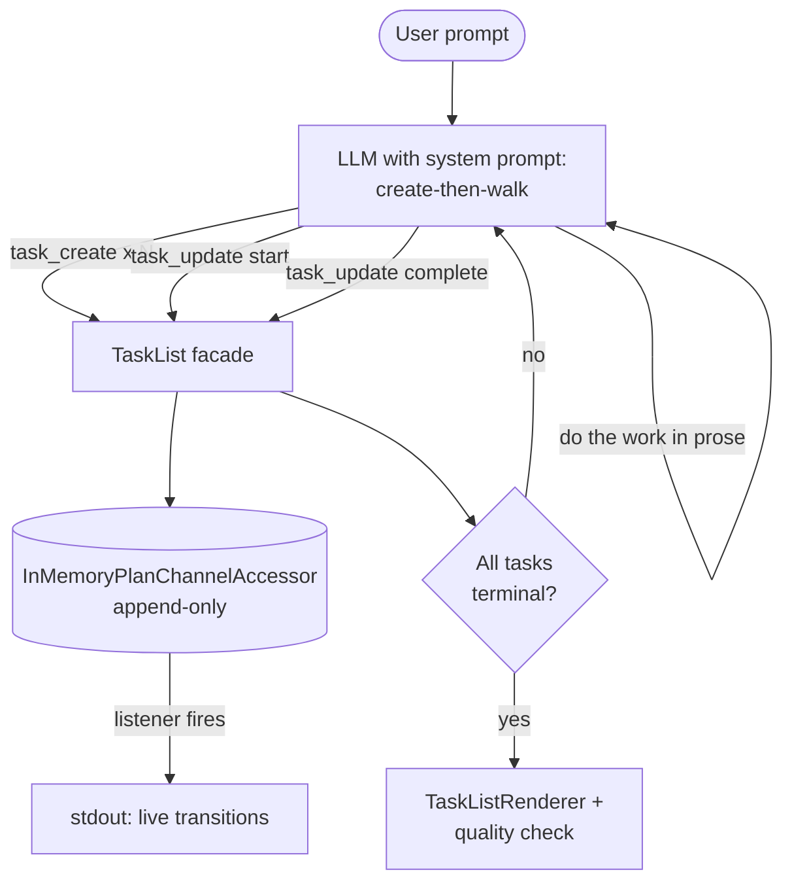

# Task List

LLMs handle multi-step problems better when they decompose first and execute second, but only if the decomposition is structured state the agent can read back — not free-text the harness has to parse. This example binds two tool callbacks (`task_create`, `task_update`) to a live `TaskList` and watches an LLM walk a real plan from pending to done, transition by transition.

## Architecture



## What You'll Learn

- Constructing a `TaskList` on top of `InMemoryPlanChannelAccessor` for per-run isolated state
- Binding Java functions to LLM tools with `FunctionToolCallback.builder(name, fn).inputType(Class).build()`
- The task lifecycle: `createTask` → `startTask` → `completeTask` / `cancelTask` (with optional `resultNote`)
- Subscribing to plan transitions via `channel.addListener((prev, curr) -> ...)` for real-time observability
- Rendering a finished plan as markdown checkboxes with `TaskListRenderer.render(channel.get())`
- Querying derived state: `taskList.allTasks()`, `pendingTasks()`, `inProgressTasks()`, `completedTasks()`, `cancelledTasks()`

## Prerequisites

- Java 21
- `OPENAI_API_KEY` in the parent `.env` file (or `SPRING_PROFILES_ACTIVE=ollama` for local Ollama)
- swarmai 1.0.24

## Run

```bash
# default: Tokyo trip prompt
./task-list/run.sh

# custom prompt
./task-list/run.sh "Plan a release for v2.0"
```

## How It Works

A fresh `InMemoryPlanChannelAccessor` and `TaskList` are created per run. A listener on the channel prints each status transition to stdout the moment it happens, so the user can watch the plan unfold. Two Java functions — one for create, one for update — are wrapped as `ToolCallback`s and exposed to the LLM. The system prompt enforces a strict create-then-walk pattern: first call `task_create` for every step (4-7 top-level tasks, each with an `activeForm` label), then for each task in order call `task_update(start)`, produce one paragraph of actual content, and finally `task_update(complete, resultNote)`. After the LLM finishes, the rendered markdown plan and a quality check (≥ 3 tasks, ≥ 1 completed, no orphaned in-progress) verify the LLM drove the full lifecycle.

## Key Code

```java
InMemoryPlanChannelAccessor channel = new InMemoryPlanChannelAccessor();
TaskList taskList = new TaskList(channel, "agent");

channel.addListener((prev, curr) -> {
    String tag = (prev == null) ? "[+]" : "[" + curr.status() + "]";
    String desc = (curr.payload() instanceof TaskItem ti) ? ti.description() : "";
    System.out.printf("  %-12s %s%n", tag, desc);
});

ToolCallback createCb = FunctionToolCallback.builder("task_create", createFn)
        .description("Add a pending task. Required: description. Optional: activeForm, parentTaskId.")
        .inputType(TaskCreateInput.class)
        .build();
ToolCallback updateCb = FunctionToolCallback.builder("task_update", updateFn)
        .description("Transition a task. Required: taskId, status (start|complete|cancel).")
        .inputType(TaskUpdateInput.class)
        .build();
```

## Customization

- Strengthen or relax the system prompt to allow batch decomposition vs. enforced create-then-walk alternation
- Enable hierarchical breakdowns: the `parentTaskId` field on `TaskCreateInput` is already wired to `taskList.createSubTask(...)`
- Adjust the quality-check thresholds (minimum tasks, minimum completed) for stricter or looser acceptance
- Swap `InMemoryPlanChannelAccessor` for a persistent `PlanChannelAccessor` implementation to survive across runs
- Add a second listener that records every transition into `TypedMessageHistory` or pushes it to a dashboard webhook
