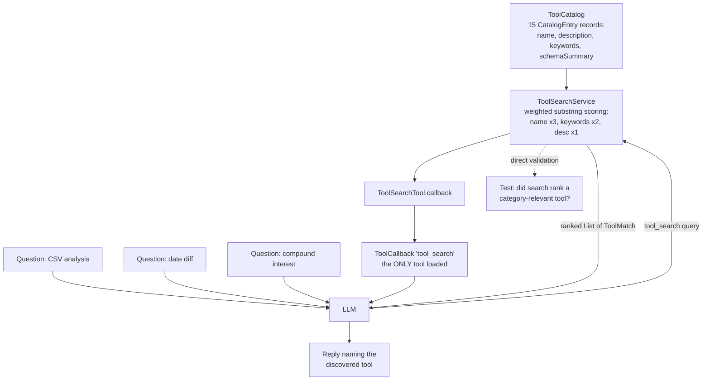

# Tool Search

Preloading every tool schema into the system prompt blows out the context window as the catalog grows from 5 to 50 to 500 tools. This example registers 15 tools in a `ToolCatalog` but exposes only one to the agent — `tool_search` — and asks three category-specific questions to verify the agent discovers the right tool through keyword search instead of upfront load.

## Architecture



## What You'll Learn

- Modelling a tool catalog with `CatalogEntry(name, description, keywords, schemaSummary)`
- Registering entries with `ToolCatalog.register(entry)` — insertion-ordered, name-keyed
- Running keyword-ranked search with `ToolSearchService.search(query, limit)` returning `List<ToolMatch>`
- Exposing the search itself as an agent-callable with `ToolSearchTool.callback(service)`
- Validating discovery quality independently of the LLM by calling `service.search(...)` directly before each prompt
- The deferred-loading pattern: flat context cost regardless of catalog size

## Prerequisites

- Java 21
- `OPENAI_API_KEY` in the parent `.env` file (the example runs three real LLM calls)
- swarmai 1.0.24

## Run

```bash
# default: runs three preset questions across csv / dates / math categories
./tool-search/run.sh

# custom one-off question
./tool-search/run.sh "Help me parse an XML response from an API."
```

## How It Works

The example builds a `ToolCatalog` populated with 15 entries spanning math (`calculator`, `statistics`, `unit_convert`), filesystem (`file_read`, `file_write`, `directory_list`), web (`web_search`, `web_fetch`, `wikipedia`), time (`current_time`, `date_diff`), and structured data (`json_transform`, `csv_analysis`, `xml_parse`, `yaml_load`). A `ToolSearchService` wraps the catalog with deterministic keyword scoring — substrings of the query are weighted ×3 against the tool name, ×2 against keywords, ×1 against the description, plus an all-terms-hit bonus. `ToolSearchTool.callback(service)` builds a single Spring AI `ToolCallback` and that is the only tool the LLM ever receives. For each of three questions, the example first runs a direct `service.search(...)` call to verify category-appropriate results, then sends the same question to the LLM, then checks whether the LLM's reply mentions one of the expected tool names. The quality check passes when all three direct searches find a category match and at least two replies reference the right tool.

## Key Code

```java
ToolCatalog catalog = new ToolCatalog();
catalog.register(new CatalogEntry("csv_analysis",
        "Profile a CSV file: column types, row count, top values per column.",
        List.of("csv", "data", "analytics"),
        "args: path (string)"));
// ... 14 more

ToolSearchService service = new ToolSearchService(catalog);
ToolCallback searchCallback = ToolSearchTool.callback(service);

// Direct validation BEFORE the LLM — pure-Java, no I/O
List<ToolMatch> matches = service.search("CSV file analysis", 5);
// -> [csv_analysis(7.0), file_read(3.0), directory_list(3.0)]

String reply = chatClient.prompt()
        .system("Use tool_search to find a relevant tool, then describe what you would do.")
        .user(userPrompt)
        .toolCallbacks(searchCallback)
        .call()
        .content();
```

## Customization

- Register more (or fewer) `CatalogEntry` records to test how scoring degrades at scale
- Tune the keyword/name/description weights inside `ToolSearchService` if your catalog has highly overlapping names
- Replace keyword scoring with embeddings: keep the `ToolSearchService` interface, swap the search implementation
- Add a second meta-tool — `tool_load(name)` — that registers the matched callback for the next turn (the natural follow-up to discovery)
- Wire `service.search(...)` into a slash command (`/tools <query>`) for human-driven discovery in the same harness
