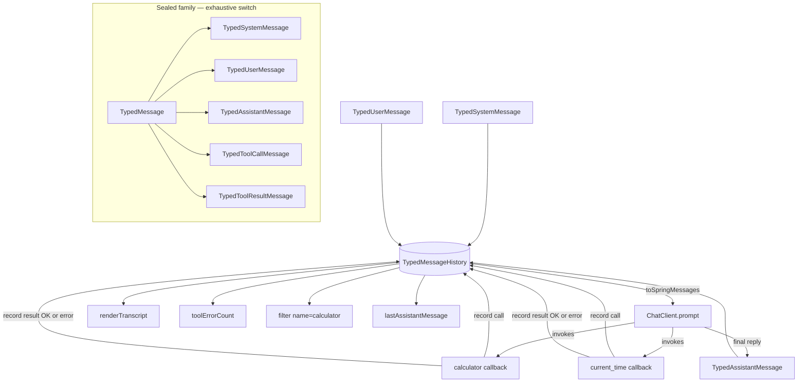

# Typed Message History

Observability code that walks a `List<Message>` ends up doing `instanceof` chains and parsing free-text content to count tool errors or filter by tool name. This example replaces that with a sealed `TypedMessage` family — `TypedToolCallMessage` carries an explicit `ToolCall(id, name, argsJson)`, `TypedToolResultMessage` has an `isError` flag — and shows a real LLM round-trip where every interaction lands as a structured record queryable by `switch`.

## Architecture



## What You'll Learn

- Building a conversation log with `TypedMessageHistory.add(TypedMessage)` using sealed-record variants
- Capturing structured tool I/O via `TypedToolCallMessage.now(ToolCall)` and `TypedToolResultMessage.success(id, content)` / `.error(id, content)`
- Querying without `instanceof`: `userMessages()`, `assistantMessages()`, `toolCallMessages()`, `toolErrorCount()`, `lastAssistantMessage()`
- Round-tripping to Spring AI via `history.toSpringMessages()` for the LLM call and `fromSpringMessages(...)` for ingestion
- Filtering tool calls by name with `history.toolCallMessages().stream().filter(c -> "calculator".equals(c.toolCall().name()))`
- Rendering a debug-friendly transcript with `history.renderTranscript()` — role tags, nested tool calls, error markers

## Prerequisites

- Java 21
- `OPENAI_API_KEY` in the parent `.env` file (the example forces both tool callbacks to be exercised by the LLM)
- swarmai 1.0.24

## Run

```bash
# default: forces both tools — "What's 7 * 23, and what time is it in UTC right now?"
./typed-message-history/run.sh

# custom prompt
./typed-message-history/run.sh "Compute 25% of 600 and tell me what time it is in Tokyo."
```

## How It Works

A new `TypedMessageHistory` is seeded with a `TypedSystemMessage` and a `TypedUserMessage`. Two tool callbacks are wired so every invocation records two messages — a `TypedToolCallMessage` carrying the `ToolCall(id, name, argsJson)` record, then a `TypedToolResultMessage` flagged as success or error. The `calculator` callback runs a tiny Shunting-Yard evaluator (supports `+ - * /`, parentheses, decimals) so failures genuinely flip the `isError` bit. The history is converted to Spring AI messages via `toSpringMessages()` for the LLM call, the assistant's reply is captured as a `TypedAssistantMessage`, and the example then prints the rendered transcript plus a battery of typed queries (size, role counts, tool-call sum, error count, filter-by-name) before running a quality check on core roles, both tools exercised, and counts matching callback invocations.

## Key Code

```java
TypedMessageHistory history = new TypedMessageHistory();
history.add(TypedSystemMessage.now(systemPrompt));
history.add(TypedUserMessage.now(userPrompt));

Function<CalculatorInput, String> calcFn = input -> {
    String callId = "call_calc_" + UUID.randomUUID().toString().substring(0, 8);
    ToolCall call = new ToolCall(callId, "calculator", toJson(mapper, input));
    history.add(TypedToolCallMessage.now(call));
    try {
        String result = evalExpression(input.expression);
        history.add(TypedToolResultMessage.success(callId, result));
        return result;
    } catch (RuntimeException e) {
        history.add(TypedToolResultMessage.error(callId, "Error: " + e.getMessage()));
        return "Error: " + e.getMessage();
    }
};

String response = chatClient.prompt()
        .messages(history.toSpringMessages())
        .toolCallbacks(calcCb, timeCb)
        .call()
        .content();
history.add(TypedAssistantMessage.now(response));
```

## Customization

- Add a third tool variant (web fetch, database query) and watch the typed queries continue to compose without code changes
- Use `history.filter(predicate)` with a custom predicate to extract any subset — e.g. all error results from a specific tool name
- Replace the `ObjectMapper` JSON encoding of `argsJson` with a domain-specific serializer for richer observability
- Persist the history by serializing the sealed family — every variant is a `record`, so it round-trips through any JSON mapper
- Add metadata to messages (trace ids, span links, routing tags) via the free-form `Map<String, Object>` per-message field
