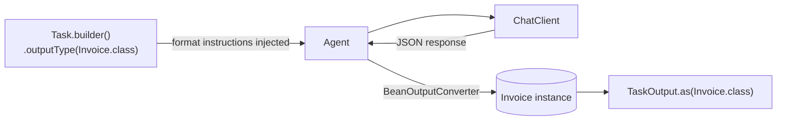

# Typed Structured Output

Declare the return type once; the framework injects JSON-schema instructions into the prompt and parses the LLM response into a real Java record. **No more `output.parseAsType(MyClass.class)` ceremony at every call site, no try/catch around malformed JSON.**

> **Why this matters:** integrators need backend agents that emit JSON that conforms to a schema. The competitor pattern (Pydantic AI, LangChain4j `@AiService`, Mastra-Zod) makes typed return types the default. SwarmAI 1.0.14 closes the gap with one builder method on `Task`.

## Architecture



## What you'll see

```bash
./typed-structured-output/run.sh
# or
./run.sh typed-output
```

```text
========== TYPED OUTPUT RESULTS ==========
📄 Invoice → vendor=Acme Cloud Services, total=1249.0 USD, due=2026-05-15
👤 Customer → name=Jane Smith, email=jane@acme.test, city=London
🧾 Order ORD-9912 → 3 line items, total=$33.45
    • Widget A x3 @ $4.5
    • Widget B x1 @ $12.0
    • Shipping x1 @ $7.95
```

## The API

```java
public record Invoice(String vendor, double total, String currency, String dueDate) {}

Task task = Task.builder()
    .description("Extract invoice fields from this text: ...")
    .agent(extractor)
    .outputType(Invoice.class)        // ← the only new line
    .build();

SwarmOutput out = swarm.kickoff(...);
Invoice inv = out.getTaskOutputs().get(0).as(Invoice.class);

// inv.vendor(), inv.total(), inv.dueDate() — full IDE autocomplete
```

## What you get for free

- **Format instructions auto-injected** — Spring AI's `BeanOutputConverter` produces a JSON-schema instruction tail that's appended to the user prompt.
- **Code-fence stripping** — most chat models wrap JSON in ` ```json ... ``` `; the framework unwraps before parsing.
- **Backward-compatible** — leave `outputType` unset and `TaskOutput.getRawOutput()` works exactly as before.
- **Failure-tolerant** — if the model returns prose ("I cannot extract that"), `getTypedOutput()` is `null` but `rawOutput` is preserved for human review (critical for compliance audit trails).
- **Works for nested records, lists, enums** — anything Jackson can serialize round-trips.

## Three target shapes in this example

| # | Shape | Demonstrates |
|---|-------|--------------|
| 1 | `Invoice` (flat record) | Smallest possible typed output target |
| 2 | `Customer` (with nested `Address`) | Nested record parsing |
| 3 | `Order` (with `List<LineItem>`) | Collection field parsing |

## Source

- [`TypedStructuredOutputExample.java`](src/main/java/ai/intelliswarm/swarmai/examples/typedoutput/TypedStructuredOutputExample.java)

## Framework changes (`swarmai-core` 1.0.14)

- `Task.Builder.outputType(Class<T>)` — declares the target type
- `TaskOutput.as(Class<T>)` — type-safe accessor returning the pre-parsed instance, falling back to lazy parse of `rawOutput`
- Auto-flips `outputFormat` to `JSON` unless explicitly overridden
- Test coverage: 19 tests in `swarmai-core/src/test/java/.../task/TypedOutputTest.java` including 6 enterprise shapes (LoanApplication, TradeOrder, AuditReport with CVE list, KycCheck, PurchaseOrder)

## See also

- [`agent-with-tool-calling`](../agent-with-tool-calling/) — typed output complements tool calling: extract structured data via tools, return as `T`.
- [`evaluator-optimizer-feedback-loop`](../evaluator-optimizer-feedback-loop/) — the evaluator can return a typed `QualityScore` record.
