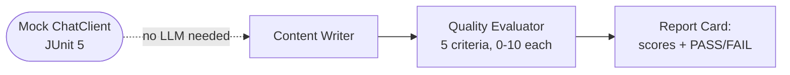

# Agent Testing & Evaluation

CI pipelines can't afford to call a real LLM every commit — and shouldn't have to. This example shows two complementary patterns: an evaluator agent that grades a writer's output across 5 criteria for runtime quality gates, and a JUnit 5 test suite that exercises the entire workflow against a mock `ChatClient` with zero tokens spent.

## Architecture



## What You'll Learn

- Building an evaluation pipeline: one agent produces content, another scores it
- Parsing structured evaluator output (scores + justifications) with regex
- Creating a content-filtering `ToolHook` that denies tool calls with blocked terms
- Generating a visual report card with per-criterion pass/fail
- Unit-testing agents, tasks, tool hooks, and score parsing WITHOUT an LLM (see test class)

## Prerequisites

- Ollama with `mistral:latest` (or any configured model)
- No additional API keys required

## Run

```bash
# Default topic
./run.sh agent-testing

# Custom topic
./run.sh agent-testing "cloud-native architecture patterns"
```

## Test

```bash
# Run the unit tests (no LLM required)
mvn test -pl swarmai-examples -Dtest=AgentTestingWorkflowTest
```

## How It Works

A Content Writer agent produces a 300-500 word article on the requested topic. A Quality Evaluator agent then scores the article on five criteria: Accuracy, Completeness, Clarity, Evidence, and Relevance, each on a 0-10 scale with a one-line justification. The workflow parses the evaluator's structured output to extract numeric scores, computes the average, and prints a report card. If the average score is 7.0 or above, the article passes; otherwise it fails. A content-filtering `ToolHook` is attached to the writer to demonstrate how to block tool calls containing sensitive terms like "proprietary" or "confidential".

## Key Code

```java
// Score parsing from evaluator output
static Map<String, Integer> parseScores(String evaluatorOutput) {
    for (String criterion : CRITERIA) {
        Pattern pattern = Pattern.compile("(?i)" + criterion + "\\s*:\\s*(\\d{1,2})(?:/10)?");
        Matcher matcher = pattern.matcher(evaluatorOutput);
        if (matcher.find()) scores.put(criterion, Integer.parseInt(matcher.group(1)));
    }
}

// Content filter ToolHook
ToolHook contentFilterHook = new ToolHook() {
    public ToolHookResult beforeToolUse(ToolHookContext ctx) {
        String params = ctx.inputParams().toString().toLowerCase();
        if (params.contains("proprietary")) return ToolHookResult.deny("Blocked term detected");
        return ToolHookResult.allow();
    }
};
```

## Customization

- Adjust `PASS_THRESHOLD` (default 7.0) to require higher or lower quality scores
- Add new criteria to the `CRITERIA` array and update the evaluator prompt
- Replace the content filter with domain-specific blocked terms for your use case
- Chain additional agents (e.g., a rewriter that improves failing articles) for a full feedback loop

## YAML DSL

This workflow can also be defined declaratively in YAML. See [`workflows/agent-testing.yaml`](src/main/resources/workflows/agent-testing.yaml):

```bash
# Load and run via YAML instead of Java
Swarm swarm = swarmLoader.load("workflows/agent-testing.yaml",
    Map.of("topic", "AI Safety"));
SwarmOutput output = swarm.kickoff(Map.of());
```

The YAML definition includes content writer and quality evaluator with scoring rubric.
