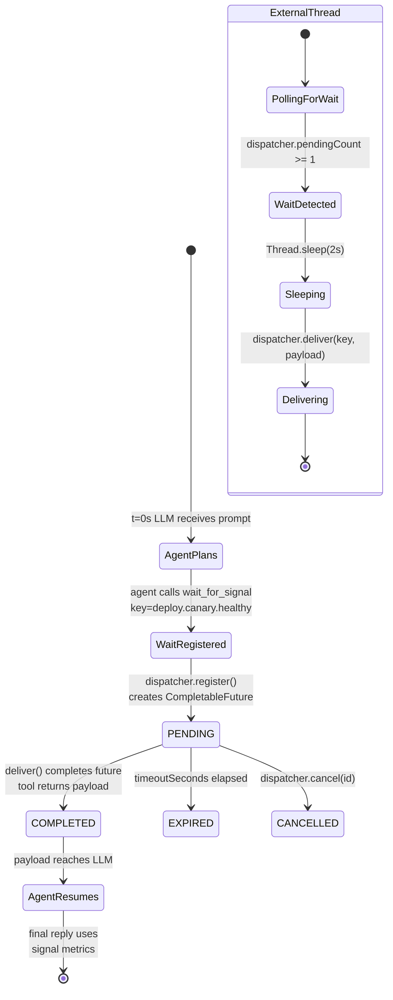

# Wait For Signal

Some agent tasks need to pause until an external event happens — a CI pipeline reports green, a webhook fires, a batch job finishes. This example gives the LLM exactly one tool, `wait_for_signal`, that blocks its tool-call thread on a `CompletableFuture`. A separate thread simulates the external system, polls until the wait is registered, then delivers the signal payload — which arrives at the LLM as the tool's return value.

## Architecture



## What You'll Learn

- Wiring a `SignalDispatcher` and exposing it as an agent-callable with `WaitForSignalTool.callback(dispatcher)`
- The `wait_for_signal(signalKey, reason, timeoutSeconds)` contract: blocks the tool-call thread until signal, timeout, or cancel
- Delivering a wake-up from any thread with `dispatcher.deliver(key, payload)`
- Inspecting state mid-run via `dispatcher.pendingCount()`, `dispatcher.allWaits()`, `dispatcher.droppedSignals()`
- The `WaitStatus` lifecycle: `PENDING` → `COMPLETED` / `EXPIRED` / `CANCELLED`
- Avoiding the deliver-before-register race by polling `pendingCount()` from the signal source before firing

## Prerequisites

- Java 21
- `OPENAI_API_KEY` in the parent `.env` file (the agent must call the tool with the right key, so it needs a capable model)
- swarmai 1.0.24

## Run

```bash
# default: canary-deployment scenario, fires 'deploy.canary.healthy' after 2s
./wait-for-signal/run.sh

# custom prompt — the agent must still call wait_for_signal with the configured key
./wait-for-signal/run.sh "Pause for the integration-test signal and report results when it arrives."
```

## How It Works

The example wires a fresh `SignalDispatcher` and wraps it as a `ToolCallback` named `wait_for_signal`. A daemon executor submits the external simulator, which polls `dispatcher.pendingCount()` every 100ms until a wait registers (avoiding the race where the signal is delivered before the agent's tool call lands). Once the wait is detected, the simulator sleeps 2 seconds, then calls `dispatcher.deliver("deploy.canary.healthy", "...metrics...")`. Meanwhile the main thread sends the user prompt directing the LLM to call the tool with the exact signal key — the tool-call thread blocks on a `CompletableFuture` until `deliver()` completes it. The payload (canary health metrics) returns from the tool as a string and reaches the LLM, which produces a final response recommending promote / hold / roll back. A quality check verifies exactly one wait reached `COMPLETED`, wall-clock elapsed exceeded the configured delay (proving the pause was real), and the reply references payload content like "healthy", "p99", or "42ms".

## Key Code

```java
SignalDispatcher dispatcher = new SignalDispatcher();
ToolCallback waitCallback = WaitForSignalTool.callback(dispatcher);

// External thread: poll for the wait to register, then deliver
Executors.newSingleThreadExecutor(...).submit(() -> {
    while (dispatcher.pendingCount() == 0) Thread.sleep(100);
    Thread.sleep(POST_REGISTER_DELAY.toMillis());
    boolean delivered = dispatcher.deliver(SIGNAL_KEY, SIGNAL_PAYLOAD);
});

// Foreground: LLM call — wait_for_signal blocks inside the tool-call thread
String response = chatClient.prompt()
        .system("You have one tool: wait_for_signal. Pause until the external system reports back.")
        .user(userPrompt)
        .toolCallbacks(waitCallback)
        .call()
        .content();

// Inspect the completed wait
for (WaitForSignalRequest w : dispatcher.allWaits()) {
    System.out.println(w.id() + " " + w.status());  // -> wait_xxxx COMPLETED
}
```

## Customization

- Change `SIGNAL_KEY` and `SIGNAL_PAYLOAD` to model a different external system (webhook URL ack, batch job exit code, scheduled-time fire)
- Increase `POST_REGISTER_DELAY` to test long pauses, or reduce `timeoutSeconds` in the prompt to trigger an `EXPIRED` wait instead
- Replace the simulator thread with a real signal source: a Spring `@RestController` mapping `POST /signal/{key}` to `dispatcher.deliver(key, body)`
- Add a wall-clock signal source by scheduling `dispatcher.deliver(...)` via `Executors.newSingleThreadScheduledExecutor()`
- Cancel a pending wait from another thread with `dispatcher.cancel(id)` to exercise the `CANCELLED` branch of the lifecycle
