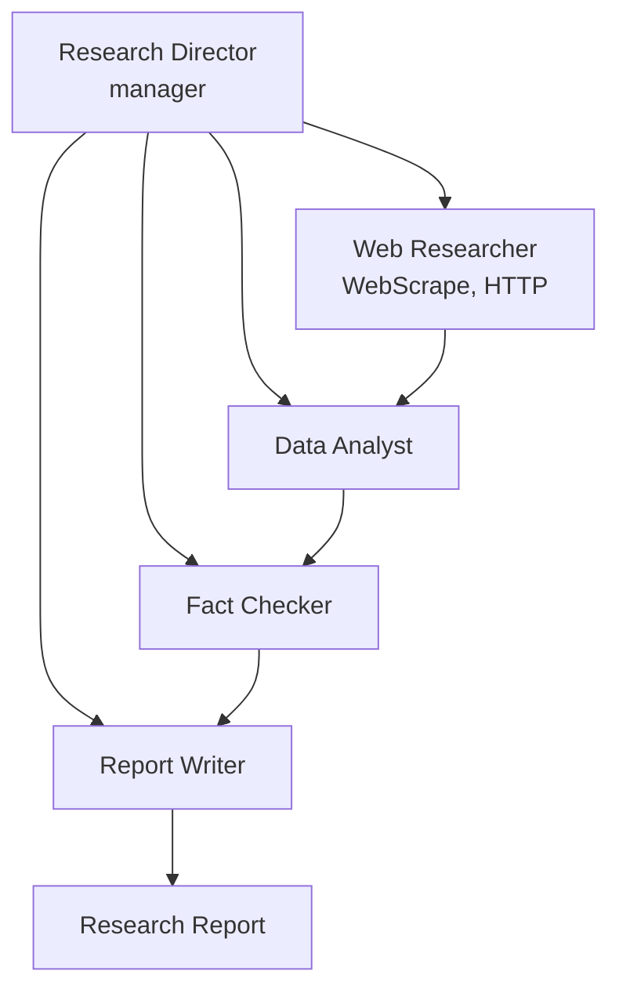

# Web Research Workflow

Hierarchical multi-agent workflow that scrapes web sources, structures data into comparison tables, cross-references facts via independent verification, and produces a research report.

## Architecture



## What You'll Learn

- Hierarchical process with a manager agent coordinating specialists
- Web scraping via WebScrapeTool for extracting content from live pages
- HTTP requests via HttpRequestTool for accessing public APIs
- Independent fact verification as a dedicated pipeline stage
- Confidence labeling: [CONFIRMED], [PARTIALLY CONFIRMED], [UNVERIFIED], [CONTRADICTED]
- Data analyst building structured comparison matrices with scoring rubrics

## Prerequisites

- Ollama running locally (or OpenAI/Anthropic API key configured)
- No additional API keys required (WebScrapeTool and HttpRequestTool work with public URLs)

## Run

```bash
./run.sh web-research
./run.sh web-research "AI agent frameworks comparison 2026"
./run.sh web-research "enterprise observability platforms"
```

## How It Works

A Research Director coordinates four specialists through a hierarchical process. The Web Researcher scrapes 3-5 relevant web pages and fetches data from public APIs to gather primary source material on the topic. The Data Analyst organizes raw findings into comparison matrices, feature tables, and market positioning maps using a 1-5 scoring rubric. In parallel with the analysis, a Fact Checker independently verifies the top 5 claims from the research against different sources, marking each as CONFIRMED, PARTIALLY CONFIRMED, UNVERIFIED, or CONTRADICTED. The Report Writer then synthesizes all prior outputs -- research, analysis, and fact-check results -- into an executive report with cross-referenced sections and a data quality disclaimer.

## Key Code

```java
// Fact check task runs in parallel with analysis (both depend on research)
Task analysisTask = Task.builder()
        .agent(dataAnalyst)
        .dependsOn(researchTask)
        .build();

Task factCheckTask = Task.builder()
        .agent(factChecker)
        .dependsOn(researchTask)     // same dependency as analysis
        .build();

Task reportTask = Task.builder()
        .agent(reportWriter)
        .dependsOn(analysisTask)     // waits for both
        .dependsOn(factCheckTask)
        .outputFile("output/web_research_report.md")
        .build();
```

## Output

- `output/web_research_report.md` -- Executive research report containing:
  - Executive summary with 5 data-backed takeaways
  - Research findings organized by category with source URLs
  - Comparative analysis with scoring tables and market positioning
  - Fact check results with verification status for each key claim
  - 3-5 actionable recommendations
  - Complete source registry of all URLs consulted
  - Data quality disclaimer

## Customization

- Pass any research query as a command-line argument
- Increase the Web Researcher's `maxTurns` (default 5) for deeper web crawling
- Add a CSVAnalysisTool to the Data Analyst for processing structured data files
- Configure the Fact Checker to verify more or fewer claims (currently top 5)
- Replace `ProcessType.HIERARCHICAL` with `ProcessType.PARALLEL` for faster execution of independent tasks
- Add domain-specific scraping targets in the research task description

## YAML DSL

This workflow can also be defined declaratively in YAML. See [`workflows/web-research.yaml`](src/main/resources/workflows/web-research.yaml):

```bash
# Load and run via YAML instead of Java
Swarm swarm = swarmLoader.load("workflows/web-research.yaml",
    Map.of("topic", "AI Safety"));
SwarmOutput output = swarm.kickoff(Map.of());
```

The YAML definition includes hierarchical 5-agent research with manager coordination.
