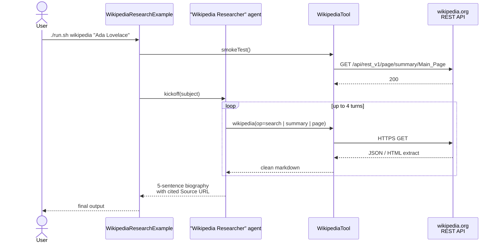

# Wikipedia Research Example

> **New to SwarmAI?** Start from the [quickstart template](../quickstart-template/) — it's the
> minimum viable SwarmAI app and actually uses this same `WikipediaTool` by default.
> This directory is the fuller recipe (agent backstory, source-citation prompt, production shape).


Exercises **`WikipediaTool`** — a research agent writes a source-cited mini-biography by calling
Wikipedia's public API for `search`, `summary`, and (optionally) the full `page`.

## How it works



## Prerequisites

**API keys / env vars:** none. Wikipedia's REST API is public and unauthenticated.

**Infrastructure:** none. Calls go straight to `https://{lang}.wikipedia.org`.

## Run

```bash
./run.sh wikipedia                       # Ada Lovelace (default subject)
./run.sh wikipedia "Albert Einstein"
./run.sh wikipedia "Multi-agent system"
```

## What to expect

A 5-sentence biography of the subject with specific dates, roles, and achievements, closing
with a `Source:` line pointing at the relevant Wikipedia URL. Every factual claim is backed by
a tool call — no hallucinated facts.

## Value add

Any agent that needs general-knowledge grounding can now cite Wikipedia directly. No paid
search API key, multilingual support via a single parameter swap (`language=de|fr|…`), and
the agent handles disambiguation (e.g. "Mercury" → planet vs element) automatically.

## What this proves about the tool

- `search` disambiguates partial names into real article titles.
- `summary` returns structured title + description + extract + source URL.
- `page` falls back for longer context when the summary is thin.
- Tool errors surface as clean `Error: …` strings (never a raw stack trace leaks to the agent).
- Multi-language edition switching works (pass `language=de` / `fr` etc. in tool params).

## Expected output shape

A 5-sentence biography with dates, roles, achievements, and a `Source:` URL pointing at the relevant
Wikipedia article.

## Known real-world bug-finders

Running this example against different subjects is a good way to surface real issues:

- Disambiguation pages (e.g. "Mercury" → planet vs element vs car) must return the flag, not random content.
- Non-ASCII titles (e.g. "São Paulo") must round-trip through URL encoding without double-encoding.
- `page` output must be capped under 8000 chars so the LLM context doesn't overflow.
