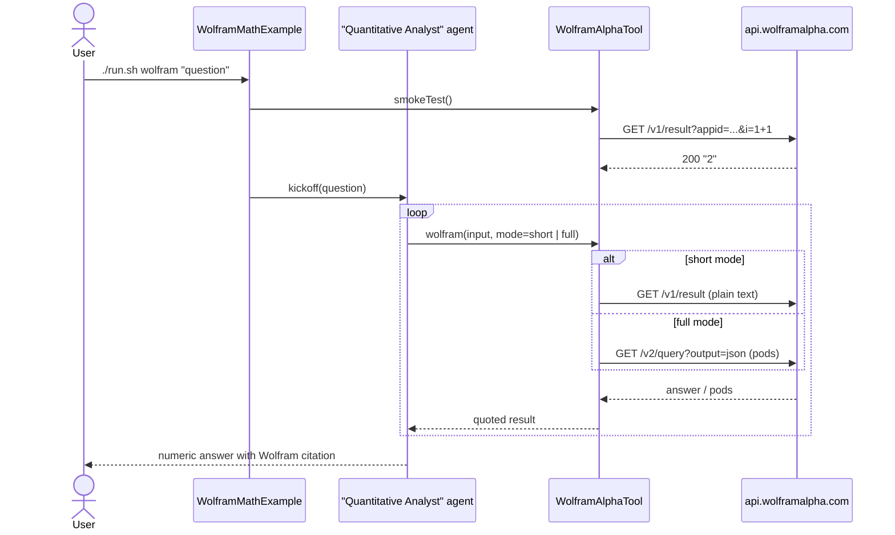

# Wolfram Alpha Math Example

> **New to SwarmAI?** Start from the [quickstart template](../quickstart-template/) for the
> minimum viable app, then come back here to swap `WikipediaTool` → `WolframAlphaTool` and copy
> the quantitative-analyst prompt below.


Exercises **`WolframAlphaTool`** — an analyst agent answers quantitative questions by calling
Wolfram Alpha for every numeric claim. Demonstrates both the "short answer" API (single-line
replies) and the "full results" API (step-by-step pods).

## How it works



## Prerequisites

**API key (required):**

| Env var          | How to get it                                                   |
|------------------|-----------------------------------------------------------------|
| `WOLFRAM_APPID`  | Free tier at https://developer.wolframalpha.com/ (2000 req/mo)  |

```bash
export WOLFRAM_APPID=your-appid-here
```

**Infrastructure:** none — the tool calls `api.wolframalpha.com` directly.

## Run

```bash
./run.sh wolfram                                     # default multi-part question
./run.sh wolfram "integrate x^2 dx from 0 to 5"
./run.sh wolfram "mass of Jupiter in kilograms"
./run.sh wolfram "10 km in miles"
```

## What to expect

For a quantitative question, the agent quotes Wolfram Alpha's short answer verbatim or walks
through structured pods (Input interpretation → Indefinite integral → Numeric result) when
symbolic reasoning is needed.

## Value add

Eliminates one of the best-known LLM failure modes — numerical and symbolic reasoning.
Analyst, finance, scientific, and engineering agents get trustworthy computations for math,
unit conversions, and physical constants they would otherwise hallucinate.

## What this proves about the tool

- Short-mode returns a single plain-text line the agent can quote verbatim.
- Full-mode returns structured pods (Input interpretation / Indefinite integral / Numeric result),
  which the agent walks through when a symbolic answer needs step-by-step reasoning.
- HTTP 501 "could not interpret" is translated into a human-readable rephrase hint.
- Missing `WOLFRAM_APPID` surfaces a setup error, not a crash.
