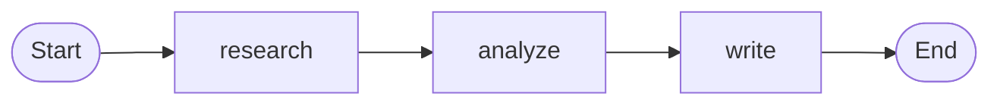
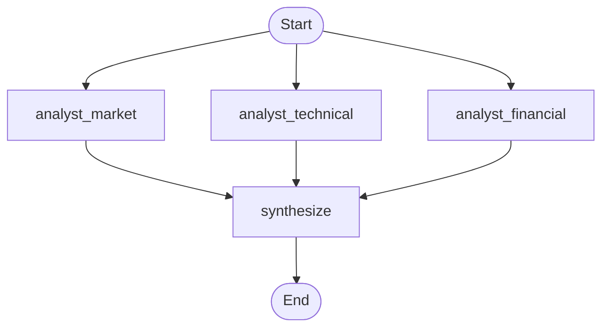
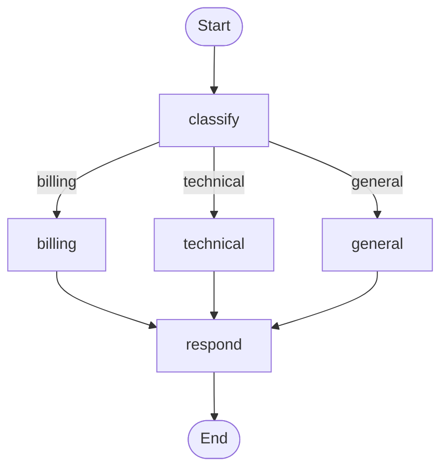
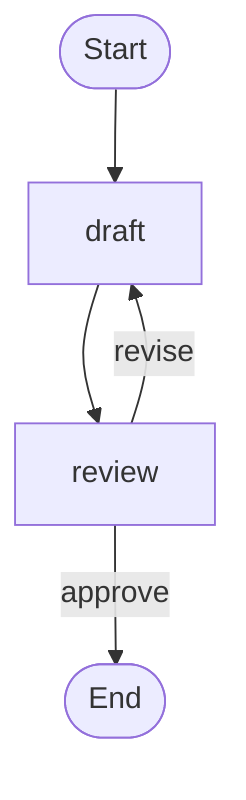

# Workflow Visualization Example

Demonstrates how to use SwarmGraph and MermaidDiagramGenerator to build
multiple workflow topologies and produce Mermaid diagrams -- without
executing any agents against an LLM (except the final proof-of-concept
run on the sequential graph).

## What This Example Does

1. Constructs four SwarmGraph topologies representing common orchestration
   patterns: sequential, parallel (diamond), conditional (router), and
   loop (iterative).
2. Compiles each graph via `compileOrThrow()` to validate structure.
3. Generates a Mermaid flowchart string for each compiled graph using
   `MermaidDiagramGenerator.generate()`.
4. Prints every diagram to the console.
5. Writes all diagrams to a single `output/workflow_diagrams.md` file.
6. Executes the sequential graph once to prove it runs end-to-end.

## Workflow Topologies

**Sequential Pipeline**



**Parallel (Diamond) Pipeline**



**Conditional (Router) Pipeline**



**Loop (Iterative) Pipeline**



## Running

From the command line:

    java -jar swarmai-framework.jar visualization

From your IDE:

    Run WorkflowVisualizationExample.main()

## Output

After execution you will find:

- `output/workflow_diagrams.md` -- all four Mermaid diagrams in one file.
  Paste any diagram into https://mermaid.live to render it interactively.
- Console output showing each diagram and the sequential execution result.

## Key Framework APIs Used

- `SwarmGraph.create()` -- fluent graph builder
- `addNode()` / `addEdge()` / `addConditionalEdge()` -- topology construction
- `compileOrThrow()` -- compile-time validation
- `MermaidDiagramGenerator.generate(CompiledSwarm)` -- diagram generation
- `CompiledSwarm.kickoff(AgentState)` -- graph execution
- `StateSchema` with `Channels` -- typed state management
- `FileWriteTool` -- injected for file output capability

## YAML DSL

This workflow can also be defined declaratively in YAML. See [`workflows/visualization.yaml`](src/main/resources/workflows/visualization.yaml):

```java
// Load and run via YAML instead of Java
Swarm swarm = swarmLoader.load("workflows/visualization.yaml",
    Map.of("project", "SwarmAI Dashboard"));
SwarmOutput output = swarm.kickoff(Map.of());
```

The YAML definition includes verbose mode for SwarmAI Studio visualization.
